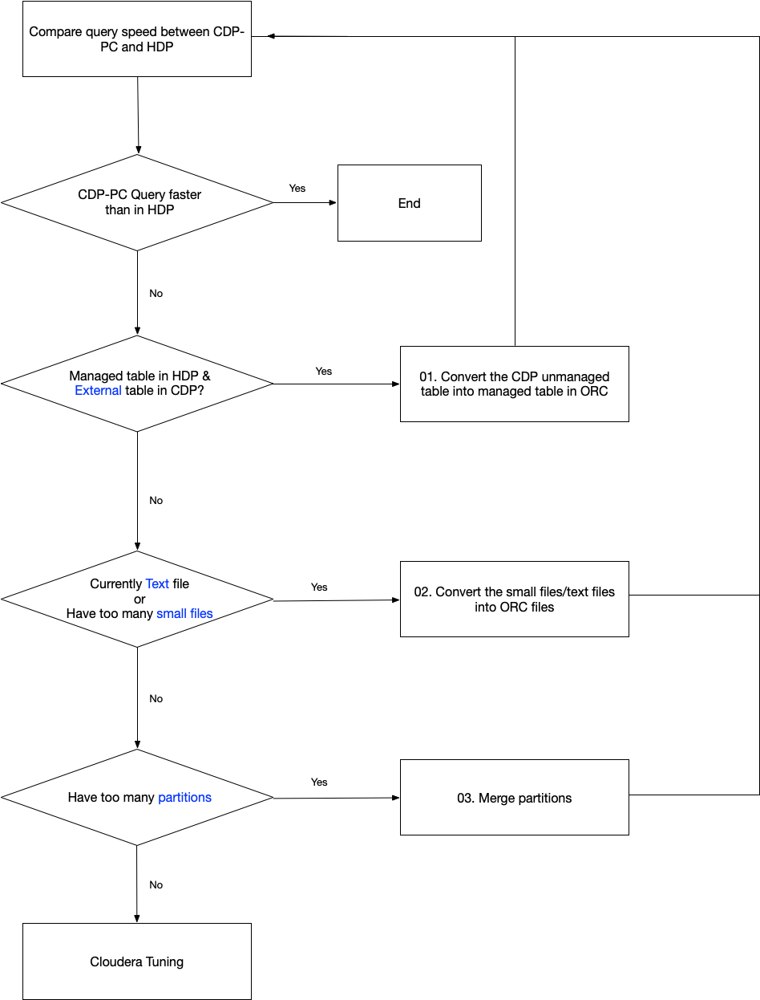

# hive_tuning

hive work flow



## 01. Convert the CDP unmanaged table into managed table

Goal: improve count(*) / aggreation functions' performance

```sql
CREATE TABLE source_table_1_managed
AS select * from source_table_1 
```

## 02. Convert the small files/text files into ORC files

### Original table is managed table:

```sql
CREATE TABLE source_table_1_orc
    STORED AS ORC
AS select * from source_table_1 
```

### Original table is external table:

```sql
CREATE EXTERNAL TABLE source_table_1_orc
    STORED AS ORC
AS select * from source_table_1 
```

## 03. Merge partitions

### Original table is managed table:

TBD
